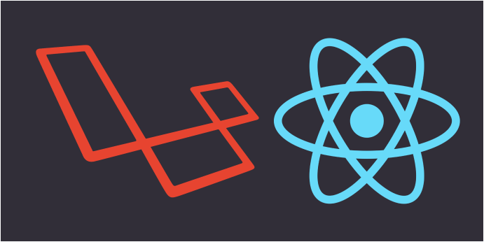
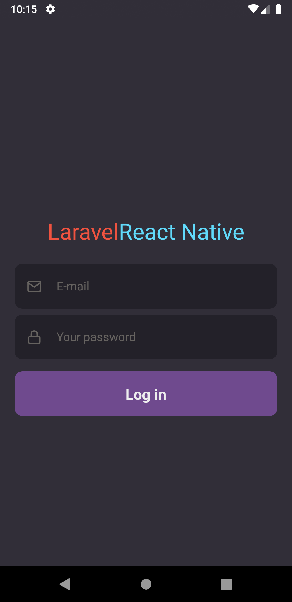
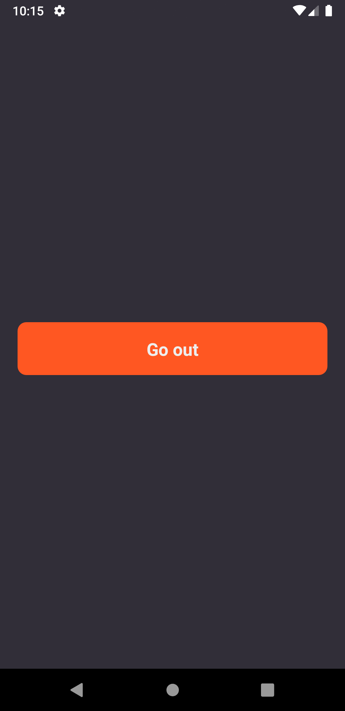

<h1 align="center">
 
  
 
 
Laravel with React Native
</h1>

The monorepo for login applications using the Api laravel consumed with React Native, as a study purpose. :iphone:

   
  
  

  
  

## :pushpin: Technologies

Listed here are some of the main technologies used in the project:

-  [React Native](https://reactnative.dev/)
-  [Laravel](https://laravel.com/)
-  [React Navigation](https://reactnavigation.org/)
-  [Axios](https://github.com/axios/axios)
-  [Styled-components](https://www.styled-components.com/)

## :pushpin: Getting started

1. Clone this repo using `git clone https://github.com/MauricioSilv/react-native-with-laravel.git`
2. Move yourself to the appropriate directory: `cd mobile` 
3. Run `yarn` to install dependencies 

### :pushpin: Getting started with the backend server

1. Move yourself to the backend folder: `cd api-laravel`
2. Create a `.env` file and add your preferred database connection.
2. Run `composer install` to install project dependencies.
3. Generate your application key `php artisan key:generate`.
3. Run `php artisan migrate --seed` to create the migrations and seedrs locate at in ``/database/seeds/UserSeeder.php.``
3. Run `php artisan serve` to start the server port `8000`.

### :pushpin: Getting started with the mobile app

1. Move yourself to the mobile folder: `cd mobile`
2. Run `yarn android` (or `ios` if your prefer) to start the mobile app

:warning:Note: at android,  You will have to start the emulator before using
the `yarn android` command.

## :memo: License

This project is licensed under the MIT License - see the [LICENSE](https://github.com/MauricioSilv/react-native-with-laravel/blob/master/LICENSE) page for details.
